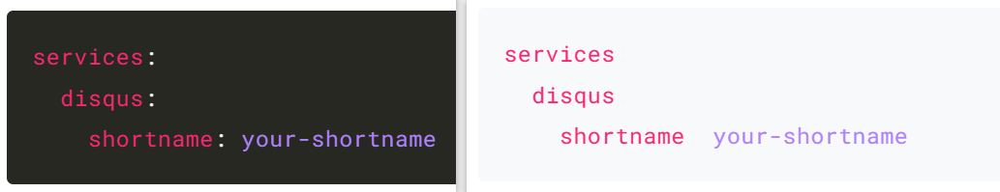

## hugo博客搭建

### 通过disqus添加评论区

可以在 https://disqus.com/admin/create 为自己的网站添加disqus，随后在`setting > general`中获取`shortname`。在`config.yml`中添加`service`选项并设置好`shortname`：

```yaml
services:
  disqus:
    shortname: your-shortname
```

随后，博客下方就多了一个评论区。

可以在`disqus`的`setting`中对评论区进行管理，比如关闭表情的显示等。不过`disqus`设置界面中会强制设置广告投放位置，会员才能关闭，通过设置支付信息，或许`disqus`还会支付一些广告费。

### 在线编辑功能

虽然hugo提供的是静态网页，但`hugo-book`在博客下方提供了`Edit this page`的选项，它会链接到github的编辑页面，这样也算具有在线编辑的功能了。

这需要配置`config.yml`文件中的` BookEditPath: try-agaaain/edit/main`选项，hugo会根据它的值自动补全链接位置，例如：https://github.com/try-agaaain/try-agaaain/edit/main/content/docs/about.md。

### 在菜单中添加链接

可以通过编辑`config.yml`文件中的`menu`选项在页面菜单中增加链接，例如：

```yaml
menu:
  # before: []
  after:
    - name: "Github"
      url: "https://github.com/try-agaaain"
      weight: 10
    - name: "About"
      url: "https://try-agaaain.github.io/try-agaaain/docs/about"
      weight: 5
```

他会在菜单下方添加Github和About两个链接。

### 链接颜色显示问题

当博客中的链接被点击后，链接的颜色会由蓝色变为紫色，不同颜色的链接出现在同一个页面上显得有些混乱。[hugo-book issues#104](https://github.com/alex-shpak/hugo-book/issues/104#issuecomment-559892163) 提到可以修改`assets/_variables.scss`下的`color-link-visited`进行链接颜色的自定义。不过我发现需要在`assets/_defaults.scss`下修改才会生效。

### 代码块背景颜色调整

不得不说，搭建个人博客是件折腾的事情，当我把很多东西调整好后，发现代码块的背景颜色不符合预期，当指定代码块语言后，背景颜色会被设置为黑色，我觉得淡灰色看起来会更舒服。在多次搜索后依然没有解决，找到了一个效果不佳的解决方案： [The `!important` might help here](https://discourse.gohugo.io/t/how-to-change-code-block-background-color/32915/2)。通过将`themes/hugo-book/assets/_markdown.scss`中的`pre > background`设定为`!important`，强制背景颜色设置为指定颜色，但这并不能设置代码字体的颜色，导致了颜色的干扰，像下面这样：



左边是设置前，右边是设置后，其中左图中的`:`因为背景颜色的淡化而变得不可见。

后面了解到可以在`config.yaml`中设置`markup > highlight`来设置代码高亮，于是直接在`config.yaml`中添加了如下内容：

```yaml
markup:
  highlight:
    style: friendly
    tabWidth: 4
```

需要注意的是，`yaml`文件中的标识不要分开写，否则可能会造成某种混乱，比如我的`config.yaml`中原本存在另一个`markup`标识，但我没太注意，将两个`markup`标识分开写，导致一直没能设置成功。对应的 [issue](https://github.com/alex-shpak/hugo-book/issues/608) 。

### 图片链接定向问题

假设有这样一个文件目录：

```shell
.
├── _index.md
└── docs
        ├── _index.md
        ├── about.md
        └── images
                └── test_image.png
```

并在about.md中通过 ``的方式使用了图片test_image.png，但是hugo并没有正确获取图像的位置，它将图像位置定位为：
http://127.0.0.1:1313/docs/about/images/test_image.png
而图像的实际位置为：
http://127.0.0.1:1313/docs/images/test_image.png

谷歌搜索后找到了这样几种解决方式：

+ 使用github action 配合图床将图像相对路径转化为网络链接：[本站引用图片的“顺滑”流程 - wrong.wang](https://wrong.wang/blog/20190301-本站引用图片的顺滑流程/)

+ 为每篇博客单独创建一个文件夹，博客内容放在该文件夹下的index.md文件中，图像放在`${filename}.assets$`文件夹下：[Hugo/Doks 静态网站图片插入问题 | 伪斜杠青年 (lckiss.com)](https://i.lckiss.com/?p=7455&cpage=1#comment-1211)

虽然是能解决图像显示问题，但太麻烦了。前者在断网的情况下不方便访问图像；后者会创建大量文件夹，文件管理不方便。

不过第一篇博客中提到图像的链接地址是可以自定义的，那么通过自定义图像链接的生成代码就能解决问题了。于是根据他的描述我找到了`hugo-book`主题下的`layouts/_default/_markup/render-image.html`文件，其内容如下：

```go
{{- if .Page.Site.Params.BookPortableLinks -}}
  {{- template "portable-image" . -}}
{{- else -}}
  
{{- end -}}

{{- define "portable-image" -}}
  {{- $isRemote := or (in .Destination "://") (strings.HasPrefix .Destination "//") }}
  {{- if not $isRemote }}
    {{- $path := print .Page.File.Dir .Destination }}
    {{- if strings.HasPrefix .Destination "/" }}
      {{- $path = print "/static" .Destination }}
    {{- end }}
    {{- if not (fileExists $path) }}
      {{- warnf "Image '%s' not found in '%s'" .Destination .Page.File }}
    {{- end }}
  {{- end }}
  
{{- end -}}

```

虽然不太能理解这些变量，但图像链接的生成代码很显眼：`  `。

只要在路径前面添加`../`，当使用 ``时，便会自动的转为 ``，这样自然就解决了。

这个问题也花了我一些时间，后面记录到了`hugo-book`的 [issue](https://github.com/alex-shpak/hugo-book/issues/166#issuecomment-2003271419) 里。

