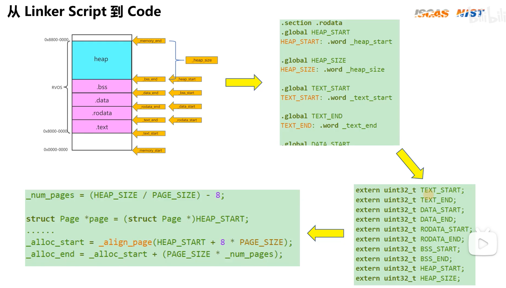

### objcopy和objdump

[Linux-GNU-C-Chater5-1.1-6(objcopy+objdump)]( https://www.bilibili.com/video/BV1mT411T78E/?share_source=copy_web&vd_source=bad63bc206890ec49ce3dba8cc7b7a37)


片上系统（CoS）、物理地址的划分


## lab7-2实现原理


```c
ld --verbose
```


### 链接器脚本文件简介

在链接器脚本文件中描述了程序不同的段在内存中的分布情况，比如下面这份链接器脚本文件：

```C++
```





### elf的program talbe和C++实际的内存地址空间布局是对应的吗？加载的过程中是如何完成的


### 观察课程代码中extern 的用法

