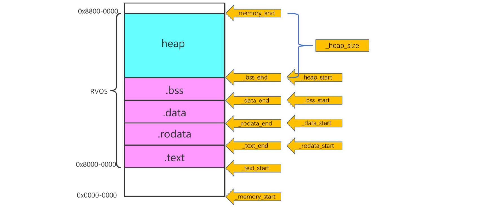
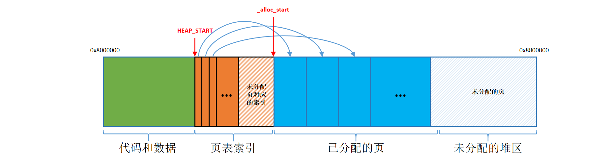
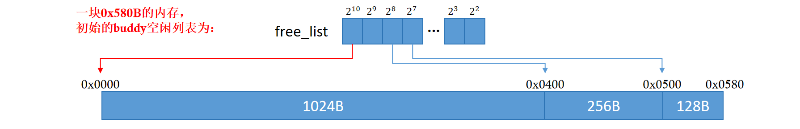
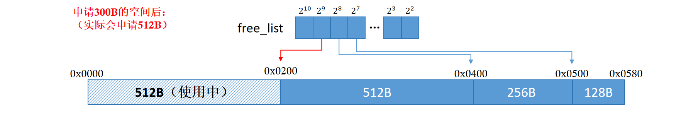

### 内存对齐的实现

[课程代码](https://github.com/try-agaaain/riscv-operating-system-mooc/blob/4698c95063d50428a7c11b289e8b4c1c213810f0/code/os/02-memanagement/page.c#L73-L77) 中通过下面的函数实现内存对齐。

```c
#define PAGE_SIZE 4096
#define PAGE_ORDER 12

static inline uint32_t _align_page(uint32_t address)
{
        uint32_t order = (1 << PAGE_ORDER) - 1;
        return (address + order) & (~order);
}
```

通过GPT了解了它的工作原理：

>`1 << PAGE_ORDER` 是将 1 左移 PAGE_ORDER（12）个位，结果是页大小（4096），再减去 1 得到一个除页大小最高位之外所有位都是 1 的数字（即 4095，二进制为 111111111111）。
>
>`address + order` 将输入地址加上4095，这样做的目的是让地址上加上一个可能会超出当前页面的值。
>
>`~order` 对 4095 取反，得到一个所有位都是 0，除了最高 12 位以外。这是一个所有低位都是 0 的掩码，用于页面对齐。
>
>`& (~order)` 然后将上述相加的结果和掩码进行按位与操作，除去低位中的所有 1，从而实现对齐。这一步确保了返回的地址会是 4096 的倍数，即页面对齐的地址。

这就像是 (8435 + 100-1) // 100 = 8500，得到的结果与100对齐。


## lab8 malloc和free实现细节

### Page 级别的内存分配和释放

首先由链接器根据链接器脚本文件确定好程序各个段的内存地址，随后计算出剩余内存空间的开始地址和结束地址作为堆的分配空间；



为便于管理堆区，将堆以页为单位进行划分（每个页的大小为`PAGE_SIZE=4096`），假设堆的起始内存地址为`HEAP_START`，将其前8个页用于存储每个页的索引信息，用户申请的内存地址从第9个页开始（地址为`_alloc_start`），索引的数据结构如下：

```c
struct Page {
	uint8_t flags;
};
```

每个page占8个比特，其中低二位可以分别用作标记：①是否已被分配`PAGE_TAKEN`；②是否为连续页的最后一页`PAGE_LAST`（连续页的释放时会用到）。

当用户申请分配`k`个页时：

①先从`HEAP_START`对应的第0个索引开始依次遍历索引数组，找到未被分配且大小合适的连续页，假设第一个页的索引号为`i`，将与其连续的`k`个索引标记为`PAGE_TAKEN`，并将第`i+k`个索引标记为连续页`PAGE_LAST`；

②通过`_alloc_start`计算出第`i`个页的内存地址，并将其返回给用户。

此时内存结构可以用下图表示：



### 字节级别的内存管理：伙伴（buddy）分配算法

对应代码：[code/os/02-memanagement/buddy/buddy.c](https://github.com/try-agaaain/riscv-operating-system-mooc/blob/lab/code/os/02-memanagement/buddy/buddy.c)

伙伴分配算法将内存空间按2的幂次方进行划分，通过一个链表数组`free_list`来记录空闲块的位置，比如一块大小为`1024B+256B+128B`的内存块，初始时根据2的幂次方可以将它划分为如下三块，由`free_list`记录每一个空闲块的地址：



（图中地址为相对地址）

当申请内存时，先确定内存块的幂，比如申请`300B`的内存：

①它的幂为9（$2^9 = 512 > 300$），在空闲链表中从幂为9的位置开始向上查找，发现$2^9$对应的链表为空；

②向上查找`2^10`对应的链表，发现里面有空闲块，起始地址为`0x0000`。

③由于该块的幂为10大于所需的9，于是将这个空闲块对半拆开，一部分分配给用户，另一部分作为伙伴块放入`free_list`。

分配后的内存空间变为：



当要释放`0x0000`处的内存块时，从$2^9$对应的空闲链表中查找对应的伙伴块，如果伙伴块存在，则将两者合并为一个块，得到幂为的10空闲块，并将块的起始地址加入空闲链表。

为了释放时获取内存块的大小，可以将内存块的尺寸信息记录在开始地址的前一个字节中，用户申请`n B`的内存时，实际申请`n+1 B`。只需记录块的幂即可，当释放`0x0000`处的内存块时，从前一个字节中取出对应的幂为`order`，通过异或运算`0x0000^(1<<order)`即可得到伙伴块的地址为`0x0200`。

**这里用户实际需要的是300B，但却分配了512B，有212B的空间其实是被浪费了的。改进的方式可以是，将212B的空间拆分为128+64+16+4，划分为四个空闲块加入到空闲链表。但释放空间时整理内存碎片会更麻烦，原先在空闲链表中找到伙伴块才考虑合并，现在没有伙伴块也要考虑是否合并。**

#### 指针的加法问题

将整型的值作为地址赋给指针可以直接通过强制类型转换完成：

```c
buddy_t * buddy = (buddy_t*) HEAP_START;	// HEAP_START is uint32_t
```

将指针地址赋值给整型变量也可以通过强制类型转换完成，需要注意的是指针的加法操作，下面是一个错误示例：

```c
uint32_t heap_begin_addr = buddy + sizeof(buddy_t);
```

上面这段代码首先将一个无符号整型`HEAP_START`作为地址赋给为`buddy_t`指针，随后让`buddy`的地址加上`sizeof(buddy_t)`作为`heap_begin_addr`。但分别打印它们的值时却发现计算上出现了不一致：

```c
printf("buddy: 0x%x, sizeof(buddy_t): 0x%x, heap_begin_addr: 0x%x\n", buddy, sizeof(buddy_t), heap_begin_addr);
输出为：
buddy: 0x800043f8, sizeof(buddy_t): 0x0000007c, heap_begin_addr: 0x80008008
```

根据前两个变量的结果，`buddy+sizeof(buddy_t)`应为`80004474`，但得到的`heap_begin_addr`却为`80008008`。

看似不起眼的问题，却花了我很长时间去排查：这里`buddy`为指针类型，**当指针与整数相加时，整数都会和指针所指向类型的大小（以字节为单位）相乘，然后把结果与初始地址相加**，所以上面这段代码等价于：`buddy起始地址 + sizeof(buddy_t) * sizeof(buddy_t)`。

根据上面输出结果，`sizeof(buddy_t): 0x0000007c`，而`heap_begin_addr - buddy = 0x3C10`，恰好为`0x7c * 0x7c`。

**解决该问题的方法有两个：①将指针转换为`char*`或`void*`即可，转化后buddy依然是指针类型，占用的字节数不变，由于char类型经占1个字节，加上整数后相当于`buddy起始地址 + sizeof(buddy_t) * sizeof(char)`，即`buddy起始地址 + sizeof(buddy_t) * 1`**，修改后的代码如下：

```c
uint32_t heap_begin_addr = (char*)buddy + sizeof(buddy_t);
```

**②将指针转化为无符号长整型，这样指针的加法就转化为了整型的加法。**

当涉及指针的加减运算时，需要特别小心，下面这段代码存在同样的问题：

```c
pointer* addr = (pointer *)(buddy->alloc_begin + buddy->alloc_size - remaining_memory);
```

其中`buddy->alloc_begin`为指针，`buddy->alloc_size`和`remaining_memory`为无符号整型，这种情况下很容易造成地址越界出现`Segmentation fault`。

**当不同类型的变量相加时，将每个变量转换为统一的类型，可以很大程度的减少错误。**

### 注意不同系统中指针占用的空间

在64位系统中，指针统一占用8位，在32位系统中，指针统一占用4位，下面这段代码在32位系统中运行正常，但在64位系统中，地址往往大于 $2^{32}$，将64位的指针`BUDDY`转化为`uint32_t`赋给指针`BUDDY->alloc_begin`后，很可能指向非法的内存引发`Segmentation fault`：

```c
BUDDY->alloc_begin = (uint32_t)BUDDY + sizeof(buddy_t) + 1;
```

**最好的做法是将`BUDDY`转化为`char*`或`void*`，这样BUDDY依然是一个指针，而它所占用的字节数始终和系统保持一致。**

