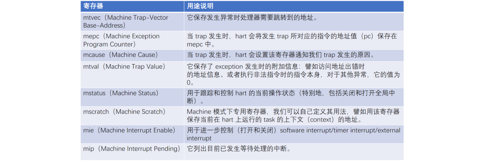

## Trap相关寄存器

异常控制流（Exceptional Control Flow，简称 ECP）包括：exception和interrupt。

其中异常是在执行程序时触发的，比如当进行除0异常和缺页异常等，所以它也叫同步异常

RISC-V 把 ECP 统称为 Trap，Trap处理过程中涉及的寄存器如下：



#### mtvec

`mtvec` 包含两部分：`BASE`和`MDOE`，其中`BASE`占`MXLEN`位，它的低2位和`MODE`重合。按照约定，`BASE`必须是4字节对齐的，所以它的低4位永远为0，其中低2位留给`MODE`使用。`MODE`的标记如下：

+ `MODE=0`表示所有Trap进入`Machine`模式时， `pc` 的值会被设置为 `BASE `字段中的地址。

+ 当 `MODE=1` 时，所有进入`Machine`模式的异常中断都会导致 `pc` 被设置为 BASE 字段中的地址，加上中断原因编号的四倍。 例如，机器模式定时器（中断号为7）中断导致 pc 设置为 BASE+0x1c。


可以通过下面这段代码进行mtvec的初始化（`MODE=0`方式）：

```c
void trap_init()
{
    reg_t MODE = 0xFFFFFFFF << 2; // 低两位设置为0
	w_mtvec((reg_t)trap_vector & MODE);
}
static inline void w_mtvec(reg_t x)
{
	asm volatile("csrw mtvec, %0" : : "r" (x));
}
```

在`trap_init`函数中`trap_vector`为中断处理函数的地址（**其实就是一个函数名，函数名可以作为指针指向对应的函数**），在`trap_vector`中定义出现Trap时的处理方式即可。

> 当Trap触发时，机器自动将pc值设置为mtvec，并在下一条指令执行对应的处理程序。在处理程序中，首先要做的是保存当前程序的上下文信息，以便Trap处理结束后恢复上下文。

#### mepc（Machine Exception Program Counter）

当 `Trap` 发生时，`pc` 会被替换为 `mtvec` 设定的地址，同时  `hart` 会设置 `mepc` 为当前指令的下一条指令的地址，当我们需要退出 `Trap` 时可以调用特殊的 `mret` 指令，该指令会将 `mepc` 中的值恢复到 `pc` 中（实现返回的效果）。

#### mcause（Machine Cause）

当 `Trap` 发生时，`hart` 会设置该寄存器通知我们 `Trap` 发生的原因。最高位为 1 时标识了当前 `Trap` 为 `Interrupt`，否则是 `Exception`。剩余的低`MXLEN-1`位用于标识具体的 `Interrupt` 或者 `Exception` 的种类。

硬件层面定义了`Trap`发生时对应的编号：


#### mtval（Machine Trap Value）

当 `Trap` 发生时，除了通过 `mcause` 可以获取`Trap`种类 code 值外，`hart` 还提供了 `mtval` 来提供其他信息来辅助我们执行更进一步的操作。具体的辅助信息由特定的硬件实现定义，RISC-V 规范没有 定义具体的值。但规范定义了一些行为，譬如访问地址出错 时的地址信息、或者执行非法指令时的指令本身等。

#### mstatus（Machine Status）


mstatus 寄存器跟踪并控制 hart 的当前运行状态，部分位的解释如下：

+ xIE（x=M/S/U）： **分别用于打开（1）或者关闭（0） M/S/U 模式下的全局中断**。当 trap 发生时， hart 会自动将 xIE 设置为 0。
+ xPIE（x=M/S/U）：当 trap 发生时用于保存 trap 发生之前的 xIE 值。
+ xPP（x=M/S）：当 trap 发生时用于保存 trap 发生之前的权限级别值。由于发生`Trap`时，并不会从高权级的`Machine`和`Super`态跳转到低权级的`User`态，所以没有`UPP`。
+ 其他标志位涉及内存访问权限、虚拟内存控制等，暂不考虑。

上面介绍的寄存器和异常有关，另外还有两个寄存器`mie`和`pie`，它们中断有关：

**mie(Machine Interrupt Enable) **：打开（1）或者关闭（0）M/S/U 模式下对应的 External/Timer/Software 中断，下图为mie示意图：


**mip(Machine Interrupt Pending) **：获取当前 M/S/U 模式下对应的 External/Timer/Software 中断是否发生，下图为mip示意图：


### Trap处理过程

中断处理过程和前面之前介绍的上下文切换过程是相近的，只是涉及到了更多的`CSR`寄存器：


当`Trap`发生时，根据设置的`mtvec`找到中断处理程序入口`trap_vector`，并在`trap_vector`进行具体的处理。在 lab8 中 由于指针非法访问出现过异常，由于没有设置`Trap`处理程序，导致程序在异常后不能顺利结束。 


