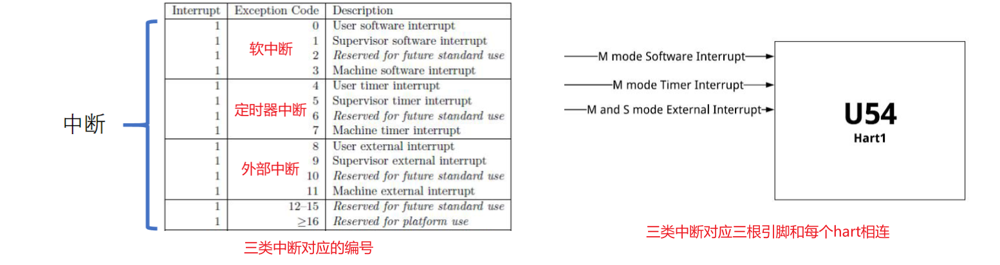
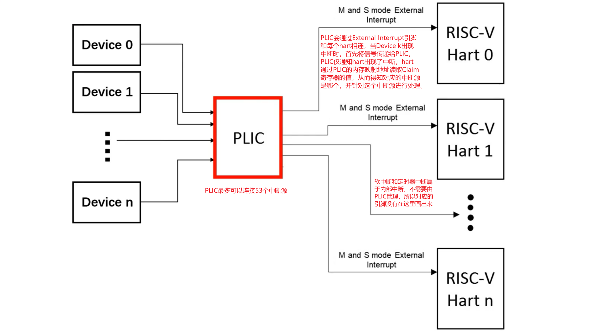
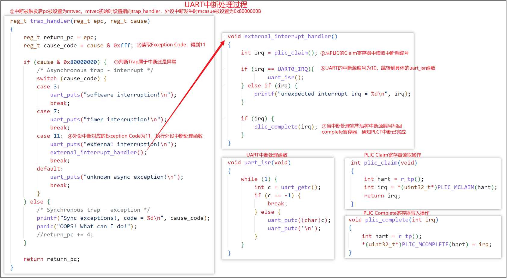

## 外部设备中断

### 中断的分类

`Trap`分为异常和中断。异常是在执行指令的过程中触发的，而中断则是由设备触发的。中断具体还可以分为三大类：软中断、定时器中断、外设中断，这些中断对应的编号如下：



中断的触发和三根与hart相连的引脚有关（如右图），其中前两个引脚对应的中断为本地中断（软中断和定时器中断），而第三条引脚对应的是外设中断，它和PLIC相连，实际上这一条引脚需要结合PLIC来处理所有的外部设备中断。

比如在`Machine`状态下出现外设中断时，引脚`M and S mode External Interrupt`会被触发，hart上的`mcause`寄存器中`Exception Code`会被设置为11。但这仅知道出现了外设中断，却并不清楚具体是什么设备触发的，这个时候就需要编程从PLIC中获取具体的中断源信息，并为每个中断源设计具体的中断处理程序了。


根据上一节`Trap`的介绍可知，当中断发生时，系统会将`pc`值设置为`mtvec`中的预设值，并转去执行中断处理程序。而中断的触发和这三个引脚有关。

### PLIC和外部设备中断处理过程

上面提到，外设中断引脚和PLIC（Platform-Level Interrupt Controller）相连，PLIC其实也是一个外设，其他所有的外部设备都和PLIC相连，如下图所示：



系统由PLIC来管理其他所有的外设中断，并由PLIC决定当多个外设同时触发中断时，将哪个外设的中断信号提交给hart，PLIC相当于“仲裁者”。

而作为外部设备，在地址空间中需要单独划分一块地址作为PLIC的内存映射，就像UART那样，通过操作对应地址上的寄存器可以实现对PLIC的读写控制。课程使用的[qemu环境外设地址](https://github.com/qemu/qemu/blob/master/hw/riscv/virt.c)分布中，PLIC的内存映射地址从0x0c000000开始，中断源一共可以有0~53个，其中0号中断源暂时保留，UART的中断源编号为10号。

可编程的寄存器有以下几个，其中`interrupt-id`即中断源编号：

| 可编程寄存器   | 功能描述                                                     | 内存映射地址                          |
| -------------- | ------------------------------------------------------------ | ------------------------------------- |
| Priority       | 设置某一路中断源的优先级。 ①每个 PLIC 中断源对应一个寄存器，用于配置该中断源的优先级。②QEMU-virt 支持 7 个优先级。 0 表示对该中断源禁用中断。其余优先级，1 最低，7 最高。③如果两个中断源优先级相同，则根据中断源的 ID 值进一步区分优先级，ID 值越小的优先级越高。 | BASE + (interrupt-id) * 4             |
| Pending        | 用于指示某一路中断源是否发生。①每个 PLIC 包含 2 个 32 位的 Pending 寄存器，每一个 bit 对应一个中断源，如果为 1 表示该中断源上发生了中断（进入 Pending 状态），有待 hart 处理，否则表示该中断源上当前无中断发生。② Pending 寄存器中断的 Pending 状态可以通过 claim 方式清除。③第一个 Pending 寄存器的第 0 位对应不存在的 0 号中断源，其值永远为 0。 | BASE + 0x1000 + ((interrupt-id) / 32) |
| Enable         | 针对某个 hart 开启或者关闭某一路中断源。①每个 Hart 有 2 个 Enable 寄存器 （Enable1 和 Enable2）用于针对该 Hart 启动或者关闭某路中断源。②每个中断源对应 Enable 寄存器的一个 bit，其中 Enable1 负责控制 1 ~ 31 号中断源；Enable2 负责控制 32 ~ 53 号中断源。 将对应的 bit 位设置为 1 表示使能该中断源，否则表示关闭该中断源。 | BASE + 0x2000 + (hart) * 0x80         |
| Threshold      | 针对某个 hart 设置中断源优先级的阈值。①每个 Hart 有 1 个 Threshold 寄存器用于设置中断优先级的阈值。②所有小于或者等于（<=）该阈值的中断源即使发生了也会被 PLIC 丢弃。特别地，当阈值为 0 时允许所有中断源上发生的中断；当阈值为 7 时丢弃所有中断源上发生的中断。 | BASE + 0x200000 + (hart) * 0x1000     |
| Claim/Complete | Claim 和 Complete 是同一个寄存器，每个 Hart 一个。①对该寄存器执行读操作称之为 Claim，即获取当前发生的最高优先级的中断源 ID。Claim 成功后会清除对应的 Pending 位。②对该寄存器执行写操作称之为 Complete。所谓 Complete 指的是通知 PLIC 对该路中断的处理已经结束。 | BASE + 0x200004 + (hart) * 0x1000     |

前面提到，当外设出现中断后，PLIC通知hart，`mcause`的`Exception Code`被设置为11，那么怎么知道具体是哪个外部设备触发的呢？

这个时候就需要使用到Claim了，比如UART触发中断并由PLIC提交给hart后，Claim的值会被设置为10，随后读取Claim的值（此时Claim会被同步的清空），当读取到的值为10时，就知道是UART触发的中断了。随后读写UART的内存映射地址以完成相关数据的处理。当中断处理完后，再将Complete（和Claim是同一个寄存器）的值置为10，表示UART中断已经被处理了，PLIC可以报告下一个中断了。

至于上面表格中提到的其他寄存器，除了Pending，都是用于配置外设的中断。在最开始的时候，PLIC上的53个外部设备中断源都是关着的，Enable寄存器上对应的bit都为0，所以这个时候即使出现了中断，PLIC也不会通知hart。为此，在初始的时候，需要操作PLIC寄存器对每个中断源进行设置。代码如下：

```c
void plic_init(void)
{
    // 获取当前的hart编号，在_start.S中将tp的值设置为了mhartid
	int hart = r_tp();
	// 将UART的优先级设置为1
	*(uint32_t*)PLIC_PRIORITY(UART0_IRQ) = 1;
	// 开启UART中断
	*(uint32_t*)PLIC_MENABLE(hart, UART0_IRQ)= (1 << (UART0_IRQ % 32));
	// 设置hart的中断阈值为0，此时所有中断都不会被丢弃
	*(uint32_t*)PLIC_MTHRESHOLD(hart) = 0;
	// 开启machine模式下的外部中断
	w_mie(r_mie() | MIE_MEIE);
	// 开启machine模式下的全局中断
	w_mstatus(r_mstatus() | MSTATUS_MIE);
}
```

最后，结合代码回顾一下整个过程：

