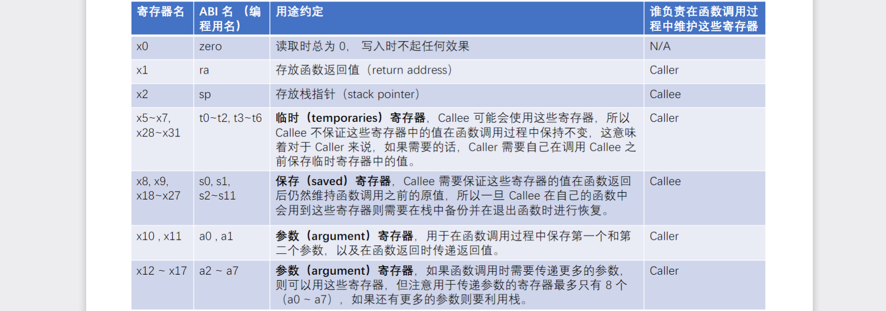
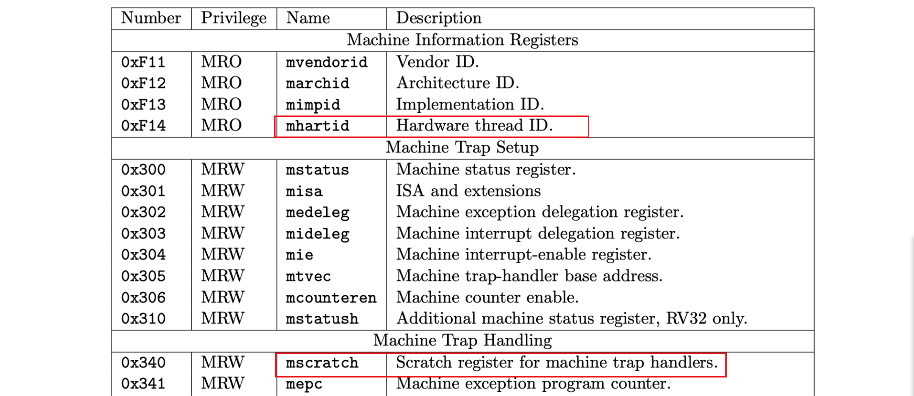
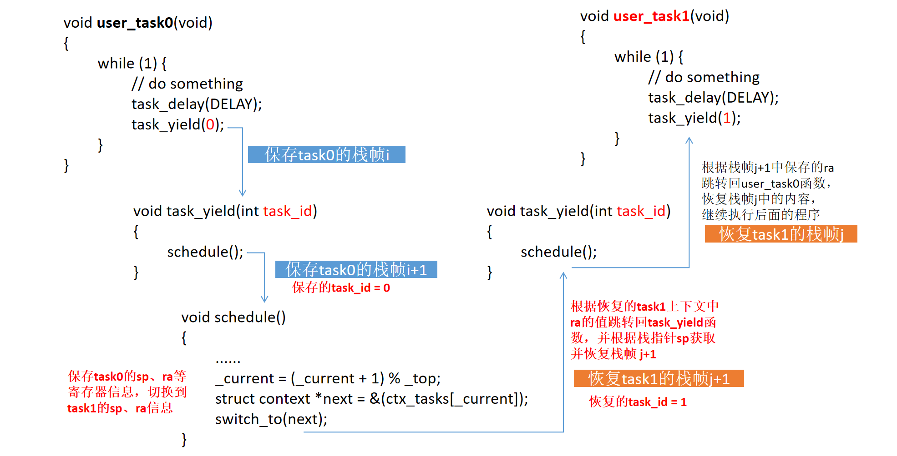

## RISC-V中的寄存器及编程约定

RISC-V中一共有32个寄存器，他们被划分为不同的用途，并分别由调用者（Caller）和被调用者（Callee）维护。

比如ra寄存器用于存放函数返回值地址，假设函数A（Caller）要调用函数B（Callee）：由于函数B必须通过ra找到返回函数A的地址，如果A调用B之前，ra中保存了关键信息（比如另一个函数X调用了A，A需要通过ra返回到函数X），则函数A需要先保存ra中的值，然后再调用B函数，否则ra中的值会在调用B的过程中丢失。B函数通过ra返回A函数后，由A恢复ra中的值，这个过程中ra是由A管理的，所以说ra是由Caller维护的。

其他寄存器的维护也是类似，具体分类见下表：


<center>
    <div> 图1 寄存器及编程约定</div>
</center>

另外还有x3和x4两个寄存器以及csr寄存器，他们的作用如下：

+ Global Pointer Register（GP）RISC-V使用x3 (gp)寄存器将所有全局变量放置在指定的特定区域。x3寄存器将保存全局变量所在位置的基址。

+ Thread Pointer Register（TP）在多线程应用程序中，每个线程可能有自己的私有变量集，称为“线程特定变量”。这组变量将由寄存器x4 (tp)指向。因此，每个线程在其x4寄存器中都有一个不同的值。

RISC-V中设计了三种不同的特权级别（User/Application、Supervisor、Machine），除了所有级别下都可以访问的通用寄存器组之外，每个级别都有自己对应的一组CSR寄存器。

高级别可以访问低级别的CSR，反之不可以。这些CSR寄存器必须由CSR指令操作。比如课程源码中的`mscratch`寄存器，用来指向当前任务的上下文地址。下面是Machine特权模式下的部分寄存器，其中`mhartid`在课程中用于获取`hart`的id号。



### 函数栈帧的维护和变量作用域

上面提到函数A调用函数B的时候需要维护相关的寄存器，即在调用函数B的前后保存和恢复相关寄存器的值，这个过程其实就是函数栈的维护过程。考虑下面两个函数：

```c
void _start() {		square(3);		}
int square(int num) {	return num * num;	}
```

他们很简短，在`_start`调用`_square`的过程中甚至完全感觉不到栈帧的存在，但其实在编译为汇编后，这里面是包括栈的维护过程的：

```assembly
.text			            # 指定以下内容为代码段
.global	_start		    # 声明全局标签_start，作为程序入口点
_start:			        # 程序入口点标签
    la sp, stack_end	    # 将标签stack_end的地址加载到堆栈指针sp中，初始化栈顶
    call square		    # 调用square函数计算平方
stop:
    j stop			        # 无限循环，程序到这里会停止并不断跳转到自身

square:			        # 定义square函数的开始
    addi sp, sp, -8	    # 将栈指针sp向下移动8字节，为保存寄存器s0和s1腾出空间
    sw s0, 0(sp)		    # 将寄存器s0的值保存到栈上
    sw s1, 4(sp)		    # 将寄存器s1的值保存到栈上，注意这是在s0之上的位置
    mv s0, a0		        # 将寄存器a0的值（函数的参数）移动到s0，用于计算
    mul s1, s0, s0	    # 将s0与自身相乘，结果存入s1，即计算平方
    mv a0, s1		        # 将计算结果s1移动到a0，作为函数返回值
    lw s0, 0(sp)		    # 从栈上恢复寄存器s0的值
    lw s1, 4(sp)		    # 从栈上恢复寄存器s1的值
    addi sp, sp, 8	    # 将栈指针sp向上移动8字节，回到之前的位置
    ret			            # 从函数返回到调用者

nop			            # 空操作，没有实际作用，通常用于对齐或者延时

stack_start:		    # 标记栈的开始
    .rept 12		        # 重复指令，下面的指令将重复12次
    .word 0		        # 在栈上分配4字节并初始化为0
    .endr		        # 结束.rept指令
stack_end:		        # 栈的结束标记
.end			            # 指示汇编器这是程序的结束
```

在最下方定义了一个栈，这个栈的大小为12个字（word），即48个字节，栈顶位置由`stack_end`确定。在调用`square`后，由于`square`用到了`s0`和`s1`寄存器，而这些寄存器原本约定是给调用者使用的（虽然`_start`实际没有使用他们），所以`square`需要将他们保存到栈中，并在返回前恢复`s0`和`s1`。

> square其实可以使用t0~t6寄存器，他们由Caller维护，上面的代码是为了说明栈的维护过程。

**通过上面的过程会发现：即使是裸机环境下，函数的调用过程中也是存在栈帧的，并且由程序自己维护。在调用函数过程中，寄存器的状态会发生变化，栈帧也会被回收和重新分配，这使得局部变量无论是存放在寄存器中，还是存放在栈中，它们的作用域都仅限于当前函数。在其他函数中访问这些局部变量很可能导致错误。**

> 编译过程中也会对作用域进行检查，变量的作用域问题很多时候会在编译时检查出来。

### 上下文切换过程

上下文切换和函数的切换相似，在课程代码实现中，上下文切换会在`schedule`函数的`switch_to`函数中完成，这会**保存调用`switch_to`时的所有寄存器信息，其中比较重要的是ra和sp寄存器，当下一次恢复这个任务时，通过ra寄存器跳转回task_yield函数，再通过栈指针找到栈帧位置并恢复。在这个过程中，只要知道栈指针，局部变量就顺利的从栈帧中恢复出来**。

下图是从`task0`切换到`task1`时信息的保存和恢复过程：



这个过程其实和函数调用后返回的过程类似，唯一不同的是在`switch_to`中寄存器的值进行了切换（即上下文切换）。在上下文切换后会回到`task_yield`函数，会发现`task_id`的值是不一样的，前者会保存在task0的第`i+1`个栈帧中，值为0；而后者恢复自`task1`的第`j+1`个栈帧中，值为1。

如果在schedule前后插入如下的打印语句：

```c
void task_yield(int task_id)
{
	printf("%d号任务即将被切换！\n", task_id);
	schedule();
	printf("%d号任务已恢复执行！\n", task_id);
}
```

会得到下面这样有趣的结果：

```shell
0号任务即将被切换！
1号任务已恢复执行！
```

### 上下文的保存和恢复

[上下文切换（B站视频）](https://www.bilibili.com/video/BV1Q5411w7z5?t=821.5&p=19) |  [课程源码](https://github.com/try-agaaain/riscv-operating-system-mooc/blob/4698c95063d50428a7c11b289e8b4c1c213810f0/code/os/04-multitask/entry.S#L96)

在课程源码中，上下文是通过下面的汇编代码完成的：

```assembly
# void switch_to(struct context *next);
# a0: pointer to the context of the next task
.globl switch_to
.balign 4
switch_to:
	csrrw	t6, mscratch, t6	# 将mscratch保存到t6寄存器，将t6保存到mscratch
	beqz	t6, 1f			# 判断t6的值【即mscratch原本的值】是否为0，是则跳转到标签1
	reg_save t6				# 保存当前任务的所有寄存器（除了t6），此时t5已被保存
	mv	t5, t6				# 将t6的值【即mscratch的值】赋给t5
	csrr	t6, mscratch	# 将mscratch【即t6原本的值】保存回t6
	sw	t6, 120(t5)			# 将t6原本的值保存到当前上下文
1:							# 继续顺序执行
	csrw	mscratch, a0	# 将下一任务的上下文地址保存给mscratch
	mv	t6, a0				# 将下一任务的上下文地址赋给保存t6
	reg_restore t6			# 恢复下一任务的上下文信息，包括ra和sp
	ret						# 跳转到下一任务
.end
```

这段简短的代码看了挺久才搞明白，其中`mscratch`寄存器的值总是指向当前任务的上下文地址。

他写的很不直观，其实上面想表达的意思和下面这段代码一样：

```assembly
switch_to:
	beqz	mscratch, 1f    # 判断mscratch的初值是否为0，是则跳转到标签1
	reg_save mscratch       # 保存当前任务所有寄存器的信息
1:                          # 继续顺序执行
	csrw	mscratch, a0    # 将下一任务的上下文首地址赋给mscratch
	reg_restore mscratch    # 恢复下一任务的所有寄存器信息，包括ra和sp
	ret                     # 跳转到ra寄存器保存的地址并执行
.end
```

唯一的问题是`mscratch`是一个特殊寄存器，它需要通过特殊的`csr`指令进行操作，如果按上面的写法会出现非法操作错误：` Error: illegal operands beqz mscratch,1f'`。

于是，课程代码用`csrrw`指令将`mscratch`的值读取到`t6`寄存器，方便后续操作，同时为避免`t6`原先的值丢失，将`t6`的值保存到`mscratch`，【即将`mscratch`和`t6`的值进行交换】。后面用`reg_save t6`保存好除`t6`的所有寄存器的值后，再将`t6`的原本的值（存放在了`mscratch`）保存到当前上下文中。

> 其实按照图1中的编程约定，在schedule调用switch_to时，如果schedule使用了t5、t6的值，则应该由schedule来维护它们，switch_to中可以随意使用它们。所以t5、t6实际上可以不用保存，甚至仅需保存一些关键寄存器的值即可（比如ra、sp）。

附一份switch_to运行过程的分析

<details> <summary> switch_to 运行过程 </summary>
<pre><code># 假设仅有两个任务，上下文分别为context0和context1
# 第一次执行，mscratch初始为0
switch_to:
	csrrw	t6, mscratch, t6    # 交换后t6=0
	beqz	t6, 1f  			# 跳转到标签1
	reg_save t6
	mv	t5, t6
	csrr	t6, mscratch
	sw	t6, 120(t5)
1:
	csrw	mscratch, a0    # 将context0的首地址赋给mscratch
	mv	t6, a0              # 将context0的首地址地址赋给t6
	reg_restore t6          # 将context0的信息恢复到寄存器，其中t6也会被重新恢复
	ret                     # 跳转到ra寄存器保存的地址并执行
.end
# 第二次执行，mscratch为全局变量，它的值保持为上一次赋予的值即context0
switch_to:
	csrrw	t6, mscratch, t6    # 交换后t6=context0，mscratch保存了t6原本的值
	beqz	t6, 1f              # 不跳转，顺序执行
	reg_save t6                 # 保存所有寄存器的值到context0（除t6寄存器）（ra为调用switch_to时的下一条命令）
	mv	t5, t6                  # 将t6的值（context0的首地址）保存到t5
	csrr	t6, mscratch    # 将mscratch的值【即t6原本的值】保存给t6
	sw	t6, 120(t5)         # 将t6保存到context0
1:                          # 继续顺序执行
	csrw	mscratch, a0    # 将context1的首地址赋给mscratch
	mv	t6, a0              # 将context1的首地址地址赋给t6
	reg_restore t6          # 将context1的信息恢复到寄存器，其中t6会被重新恢复
	ret                     # 跳转到ra寄存器保存的地址并执行
.end
# 第三次执行，mscratch为全局变量，它的值保持为上一次赋予的值即context1
switch_to:
	csrrw	t6, mscratch, t6    # 交换后t6=context1，mscratch中暂存t6原本的值
	beqz	t6, 1f              # 不跳转，顺序执行
	reg_save t6                 # 保存所有寄存器的值到context1（除t6寄存器）
	mv	t5, t6                  # 将t6的值（context0的首地址）保存到t5
	csrr	t6, mscratch    # 将mscratch的值【即t6原本的值】保存给t6
	sw	t6, 120(t5)         # 将t6保存到context1
1:                          # 继续顺序执行
	csrw	mscratch, a0    # 将context0的首地址赋给mscratch
	mv	t6, a0              # 将context0的首地址地址赋给t6
	reg_restore t6          # 将context0的信息恢复到寄存器，其中t6会被重新恢复
	ret                     # 跳转到ra寄存器保存的地址并执行
.end  
</code></pre>
</details>
